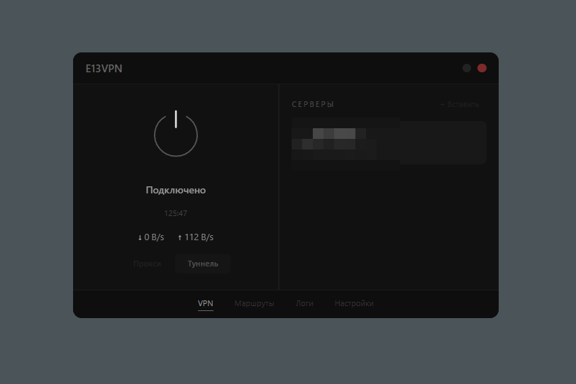
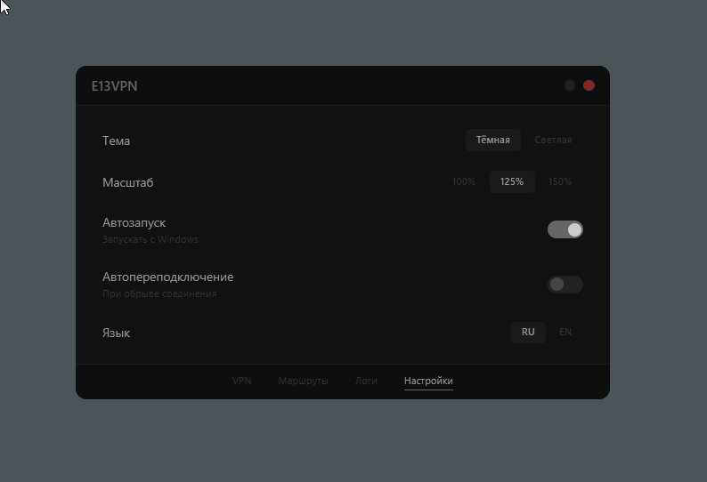

# E13VPN

Lightweight VPN client for Windows with Proxy and TUN modes. Built with Tauri v2, React 19, sing-box 1.13, Vite 7.

Легковесный VPN-клиент для Windows с поддержкой VLESS+Reality.

<p align="center">
  
  
</p>

## Features / Возможности

- **Proxy mode** — HTTP/SOCKS proxy on a randomized port
- **TUN mode** — full system traffic through encrypted tunnel
- Real-time speed indicator (download/upload)
- Route bypass by domains, IP addresses, and applications
- Auto-reconnect with exponential backoff and crash loop protection
- VLESS config management with DPAPI encryption
- Dark / Light theme
- UI scaling (100% / 125% / 150%)
- Russian / English interface
- Autostart with Windows
- System tray with dynamic icon
- Single instance protection
- sing-box log viewer with auto-scroll
- Clash API secured with per-session secret

## Installation / Установка

Download the latest release from [Releases](../../releases) — install `.msi` or run portable `.exe`.

## Requirements / Требования

- Windows 10+
- Administrator privileges (for TUN mode)

## Build from source / Сборка

```bash
npm install
npm run tauri build
```

## Tech stack / Стек

| Component | Version |
|-----------|---------|
| Tauri | v2 |
| React | 19.1 |
| sing-box | 1.13.3 |
| Vite | 7 |
| TypeScript | 5.8 |
| Tailwind CSS | 4.2 |

## License

MIT
